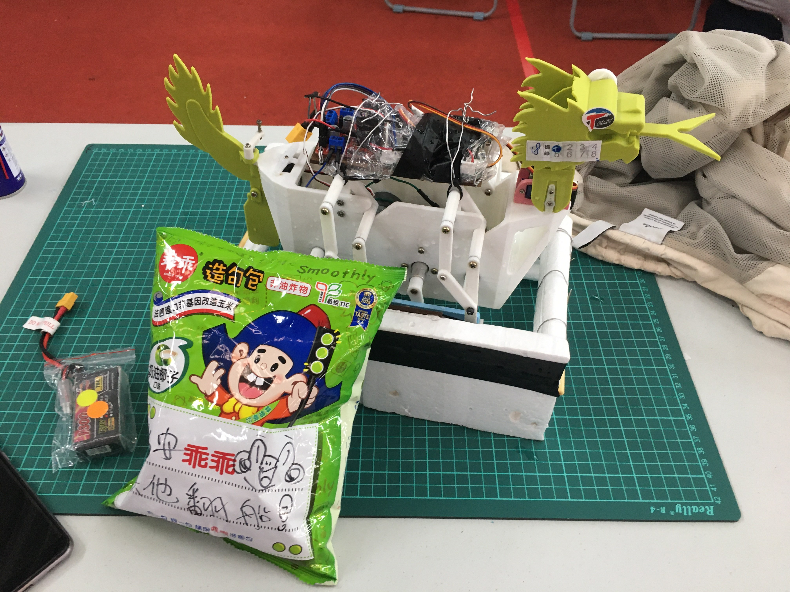
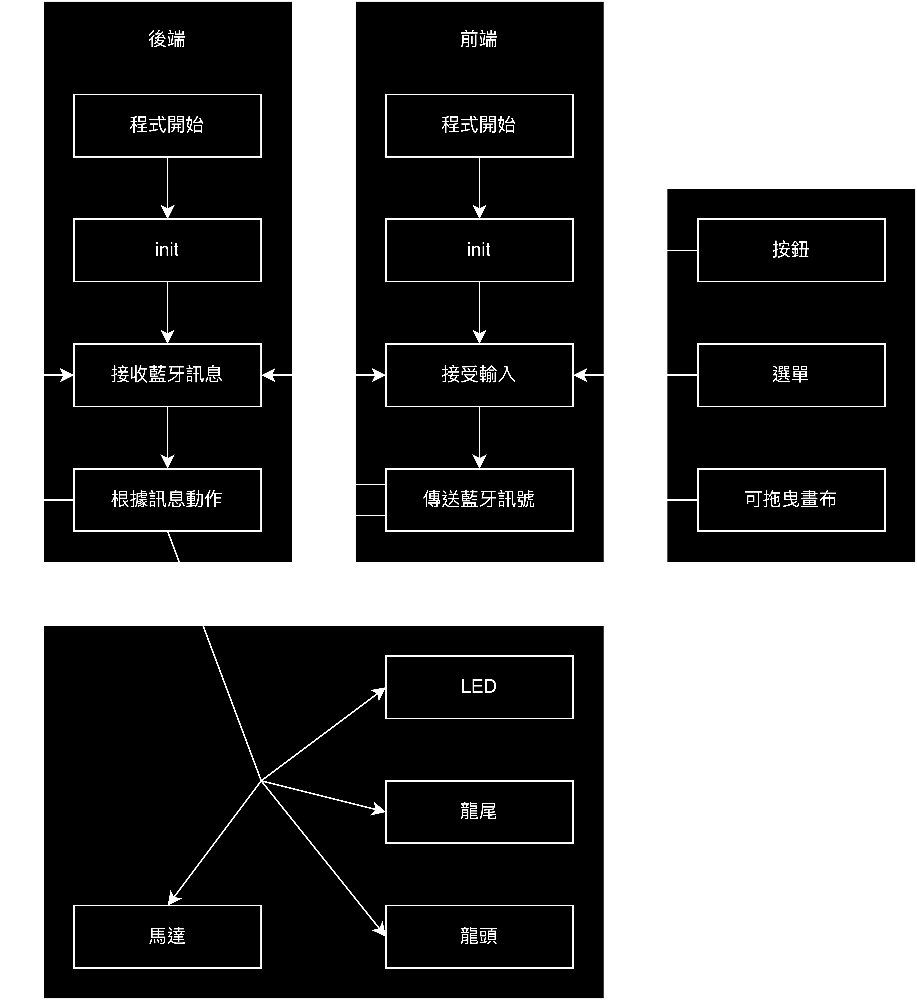

# 2023_DragonBoat

> Use app to send blueteeth message and control boat by esp32.

龍舟本人：

 

## 程式設計

程式流程圖

 

## 檔案介紹

- `2023_DragonBoat.ino`：位於esp32上的檔案，由Arduino(1.8.15)寫入
- `Boat.apk`：裝在Android上的控制程式
- `Boat.aia`：app inventor程式原檔

## 程式特色

觀察到在前進時會需要微調方向，而每次把按鍵放開都會使船停下來。因此我將前進鍵加上了左右調整的功能，不用放開手就可以微調方向。

具體的實現方法是將按鈕變成畫布，並且偵測使用者案的位置。如果按的位置偏左則向左開，向右則向右開。

## 相關程式

